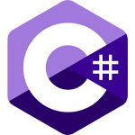
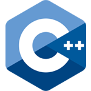
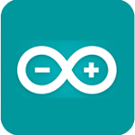
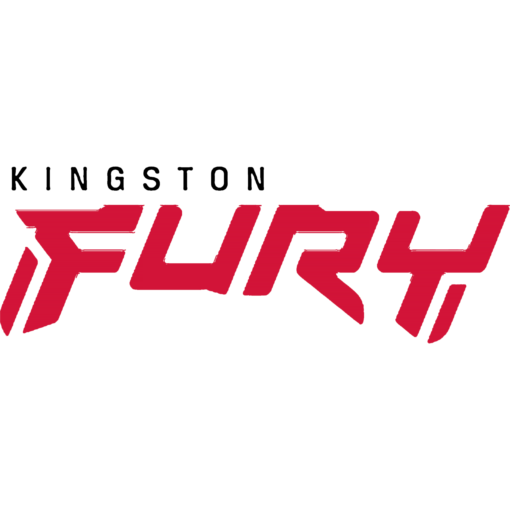

<h1 align="center">Hey, I'm Thomas Fang-chern Lim</h1>
<h3 align="center">A passionate software developer from Penang, Malaysia.</h3>
<!-- <h4 align="center">A future software architect.</h4> -->
 

- 🌱 TARUMT University Student - **Bachelor of Software Engineering (Honours)**

- 🛒 e-Entrepreneur - [TCT Thomas Comonics Technology](https://thomascomonicstechnology.github.io/tct/)
    
- 🎬 YouTube Content Creator - [CTS Computer Technology Solutions](https://youtube.com/channel/UCJQqFq3O7H-8kuJZMd0k3KA)

- 📫 How to reach me - [LinkedIn](https://www.linkedin.com/in/limfangchern)

 

<h3 align="left">4 Major Categories of Technologies I've Explored, Coded, or Utilized 😎</h3>

<h4 align="left">1) Programming Languages: </h4>

    
    
    
    
    
    
    
    
    
    
    

<h4 align="left">2) IDE Software / IT Services: </h4>

    
    
    
    
    
    
    
    
    
    
    
    
    

<h4 align="left">3) Operating System (OS): </h4>

    
    
    
<!--      -->
    

<h4 align="left">4) Others: </h4>

    
    
    
    
    

 

  

 

# 🎮 My Asus TUF Gaming F15 Gaming Laptop Specifications

## 🖥️ CPU - Central Processing Unit
**11th Gen Intel® Core™ i5-11400H @ 2.70GHz**  

## 🎮 GPU - Graphic Processing Unit
**NVIDIA GeForce RTX 3050 Laptop GPU**  

## 🛠️ RAM - Random Access Memory
**Kingston Fury Impact DDR4 8GB x2**  

---
### 🔗 Additional Information
- **Operating System:** Windows 11
- **Storage:** Intel NVMe SSDPEKNU512GZ SSD 500GB
- **Secondary Storage:** Kingston NV2 M.2 2280 PCIe NVMe Gen4 SNV251000G SSD 1TB
- **Network Card:** MediaTek Wi-Fi 6 MT7921 Wireless LAN Card
- **Display:** Asus Laptop Screen 15.6" 144Hz (1920x1080)
- **Monitor:** HP M24D FHD Monitor 23.8" 75Hz (1920x1080)

